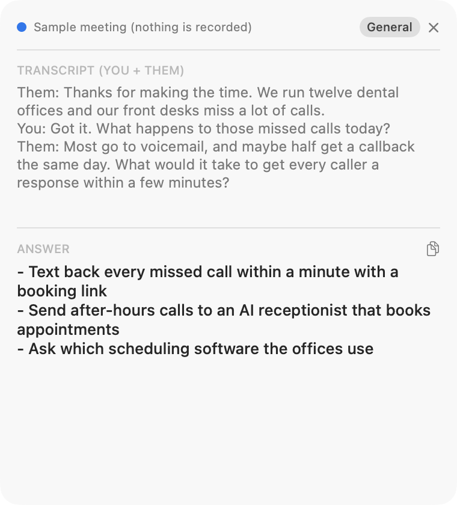

# Meeting Assistant

**A private, bot-free live copilot for your calls.** Meeting Assistant listens to your
Mac's audio (the other people on a Zoom, Meet or Teams call) and your microphone,
transcribes both on your Mac, and shows Claude's suggestions in a small floating
overlay while the conversation is still happening.

<p align="center">
  
</p>

- **Your call audio stays on your Mac.** Transcription runs on-device; only the
  transcript excerpt behind a question goes to Claude, with your own API key.
- **No bot joins the call.** Nothing appears in the participant list, and it works
  with any app that plays sound.
- **Help while it's still useful.** Press ⌘⇧Space for suggestions, or let auto-answer
  respond whenever the other side asks a question.
- **Free and open source** under the MIT license. Bring your own Anthropic API key;
  there is no subscription.

Made by [Stephen Thorn](https://stephenthorn.com).

## Try it in 15 seconds

Launch the app and choose **Try a Sample Meeting** on the welcome screen (or from the
menu bar icon). A scripted sales call plays in the overlay and Claude suggests what to
say next; without an API key you get sample answers. Nothing is recorded.

## Use it on your own sales calls

Pick the **Sales** profile and describe what you sell under **Settings > Extra
instructions**, for example:

> I sell <your product or service>. When the prospect describes a problem it solves,
> suggest it in one line, plus one question that qualifies the need.

Start listening before the call and keep the overlay beside it. Tell the people you
talk to that you use an AI assistant (see [Consent](#consent)).

## How it works

```
system audio (ScreenCaptureKit)  -> "Them" transcriber -\
microphone (AVAudioEngine)       -> "You"  transcriber -/
      -> merged, speaker-labeled transcript
      -> [⌘⇧Space or auto-answer] -> Claude Messages API (streaming)
      -> floating overlay (local, non-activating)
```

## Features

- Two-sided transcription: system audio (them) + microphone (you), merged into one
  speaker-labeled transcript in the order people spoke.
- On-device STT: SpeechAnalyzer on macOS 26+, SFSpeechRecognizer on 14–15.
- Optional **Deepgram** cloud STT for the hardest audio, off until you confirm
  sending it audio. It keeps the stream alive through silences and reconnects if
  the connection drops.
- Live Claude answers streamed into the overlay, with a copy button.
- **Auto-answer** when the other side asks a question; it never interrupts an answer
  in progress.
- Echo suppression: on speakers your mic also hears the other side, so "You" lines
  that repeat what they just said are hidden.
- A welcome screen that says exactly what is captured and where it goes, and a
  record icon in the menu bar whenever audio is being captured.
- **Settings** (menu bar icon, then Settings…): API key in the macOS Keychain, model
  (Haiku / Sonnet / Opus), profile, extra instructions, shortcuts, privacy, and
  links to the macOS permissions.
- Global shortcuts, changeable in Settings: ⌘⇧Space to answer, ⌘⇧H to show or hide
  the overlay. The overlay remembers where you dragged it.

## Download

Grab `MeetingAssistant.app.zip` from the latest [Release](../../releases/latest), or
from the **Actions** tab (latest `build` run > Artifacts). Signed and notarized
releases open normally. An ad-hoc signed build needs quarantine cleared before first
launch:

```bash
unzip MeetingAssistant.app.zip
xattr -dr com.apple.quarantine MeetingAssistant.app
open MeetingAssistant.app
```

An ad-hoc build has a new code identity every release, so macOS asks for Screen
Recording and Microphone again after each update.

## Build from source

Requirements: macOS 14+ at runtime, Xcode 26+ to build (the macOS 26 SDK defines
SpeechAnalyzer; the app still deploys to 14), [XcodeGen](https://github.com/yonsm/XcodeGen)
(`brew install xcodegen`), and an Anthropic API key (optionally a Deepgram key).

```bash
git clone https://github.com/stephenlthorn/meeting-assistant.git
cd meeting-assistant
./scripts/bootstrap.sh     # installs XcodeGen if needed, generates the project, opens Xcode
```

Or manually: `brew install xcodegen && xcodegen generate && open MeetingAssistant.xcodeproj`.

Select the **MeetingAssistant** scheme and Run (⌘R). The app has no Dock icon and no
app menu: click the waveform icon in the menu bar and choose **Settings…** to paste
your Anthropic API key (stored in the Keychain).

Run the tests:

```bash
xcodegen generate
xcodebuild test -project MeetingAssistant.xcodeproj -scheme MeetingAssistant -destination 'platform=macOS'
```

### Where the API key comes from

Checked in this order; Settings shows which one is in use.

1. The Keychain (saved from Settings).
2. The `ANTHROPIC_API_KEY` environment variable. Only an app started from Terminal or
   Xcode sees your shell's environment; opened from Finder, it does not.
3. `~/.config/meeting-assistant/anthropic_key`, which works however the app is launched.

The Deepgram key comes from the Keychain, then `DEEPGRAM_API_KEY`.

## Permissions

- **Screen Recording** captures the other side's audio (ScreenCaptureKit needs it even
  for audio only). macOS asks the first time you Start Listening; after allowing it,
  quit and reopen the app.
- **Microphone** captures your side. Deny it and the app transcribes their side only.
- **Speech Recognition** is needed on macOS 14–15 only; SpeechAnalyzer on macOS 26 runs
  without it.

When a permission is missing, the overlay says so with an **Open Settings** button for
the right privacy pane.

## Privacy

Speech is transcribed on your Mac. Transcript excerpts go to Anthropic only when an
answer is requested, and audio goes to Deepgram only if you turn it on. There are no
analytics, accounts or developer servers. The full policy is in [PRIVACY.md](PRIVACY.md).

## File map

| File | Responsibility |
|------|----------------|
| `Sources/App/AssistantController.swift` | Session lifecycle, transcript, answers, auto-answer, sample meeting |
| `Sources/App/SampleMeeting.swift` | The scripted sample call and its sample answers |
| `Sources/App/TranscriberSlot.swift` | Hands audio from capture threads to the current transcriber |
| `Sources/App/Problem.swift` | Problems shown to the user and the privacy pane that fixes each |
| `Sources/App/AppLinks.swift` | Source code, privacy policy and website links |
| `Sources/App/MeetingAssistantApp.swift` | App entry, menu bar, Settings scene, overlay, welcome window, shortcuts |
| `Sources/Audio/CaptureInterfaces.swift` | Capture protocols and threading helpers |
| `Sources/Audio/SystemAudioCapture.swift` | ScreenCaptureKit system-audio capture (them) |
| `Sources/Audio/MicCapture.swift` | AVAudioEngine microphone capture (you), restarts on device changes |
| `Sources/Audio/AudioMath.swift` | Level and mono-mix helpers |
| `Sources/Audio/LiveTranscriber.swift` | Transcriber protocol + backend factory |
| `Sources/Audio/AnalyzerTranscriber.swift` | macOS 26+ SpeechAnalyzer backend |
| `Sources/Audio/LegacySpeechTranscriber.swift` | macOS 14–15 SFSpeechRecognizer backend |
| `Sources/Audio/CloudTranscriber.swift` | Optional Deepgram cloud STT (WebSocket) |
| `Sources/Transcript/Transcript.swift` | Merged, speaker-labeled transcript |
| `Sources/Transcript/QuestionDetector.swift` / `EchoDetector.swift` | Auto-answer trigger / echo suppression |
| `Sources/LLM/AnthropicClient.swift` | Streaming Claude Messages API client |
| `Sources/LLM/Profiles.swift` | Per-use-case system prompts |
| `Sources/UI/OverlayPanel.swift` / `OverlayView.swift` / `OverlayText.swift` | Floating overlay |
| `Sources/UI/WelcomeView.swift` | Welcome screen: what is captured and where it goes |
| `Sources/UI/SettingsView.swift` | Preferences window |
| `Sources/UI/Clipboard.swift` | Copy helper |
| `Sources/System/AppSettings.swift` / `KeychainStore.swift` | Settings, consent + Keychain |
| `Sources/System/HotKeyManager.swift` / `HotKeyBinder.swift` | Global shortcuts (Carbon) |
| `Resources/Assets.xcassets` | App icon (regenerate with `swift scripts/make-app-icon.swift`) |
| `Config/MeetingAssistant.entitlements` | Hardened-runtime microphone entitlement |
| `Tests/` | Unit tests (a hostless XCTest bundle over the app sources) |

## Releasing

Bump `VERSION` (for example `v0.2.0`) on `main` and push. The release workflow tests,
builds, signs and publishes it, and never re-publishes an existing tag. Releases are
ad-hoc signed until these repository secrets exist; then they are signed with your
Developer ID and notarized:

| Secret | Value |
|--------|-------|
| `MACOS_CERTIFICATE_P12` | Base64 of a Developer ID Application certificate (.p12) |
| `MACOS_CERTIFICATE_PASSWORD` | Its export password |
| `MACOS_SIGNING_IDENTITY` | For example `Developer ID Application: Your Name (TEAMID)` |
| `APPLE_ID`, `APPLE_TEAM_ID`, `APPLE_APP_PASSWORD` | For notarization (an app-specific password) |

`scripts/setup-release-signing.sh path/to/DeveloperID.p12` stores all six with the
GitHub CLI. Create the certificate in Xcode (Settings > Accounts > Manage
Certificates > Developer ID Application) and export it from Keychain Access.

## Notes

- **Latency**: ~1.5–3s speech-to-answer, dominated by model choice; Haiku is fastest.
- **Screen sharing**: the overlay is a local window, invisible to the other side when
  you are not screen sharing. `sharingType = .none` does not hide it from
  ScreenCaptureKit-based full-screen shares on macOS 15+.
- **Signing**: the app uses the hardened runtime with the microphone entitlement,
  without the App Sandbox.

## Consent

Recording call audio is subject to consent laws that vary by jurisdiction. You capture
your own device as a participant, but tell the people you talk to that you use an AI
assistant, and get consent where the law requires it. Not legal advice.

## Contributing

Issues and pull requests are welcome; see [CONTRIBUTING.md](CONTRIBUTING.md).

## License

[MIT](LICENSE) © 2026 Stephen Thorn
